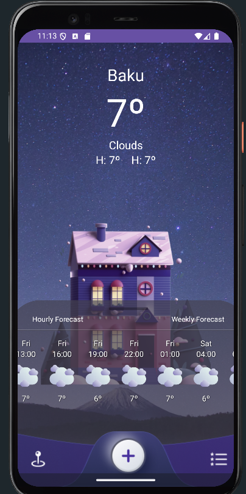
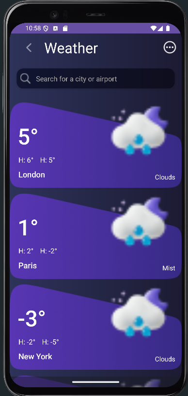

📌 Weather App
📖 About the Project
This project is a simple and user-friendly weather application developed in Kotlin. Users can easily view the current weather information for their selected cities. The app fetches real-time data using the OpenWeatherMap API

🚀 Features
Current Weather: Displays real-time temperature, weather condition, and location.
Forecast: 7-day weather forecast with detailed information.
Search: Search weather conditions for any city worldwide.

🛠️ Technologies
The following technologies were used in this project:

Kotlin: For Android application development.
Retrofit: For API data fetching.
ViewModel & LiveData: To implement MVVM architecture.
Coroutines: For asynchronous data operations.
Glide: For loading images

⚙️ Setup
Follow these steps to set up the project on your local environment:

Clone the repository:
https://github.com/MusaHesenov/WeatherApp.git

Add the API Key:

Obtain an API key from OpenWeatherMap.
Add the following line to the local.properties file:
WEATHER_API_KEY=your_api_key_here

Run the project:

Open the project in Android Studio.
Click the Run button to launch the app.

## Screenshots

| Home Screen | Search Screen | 
|-------------|---------------|
|  |  |

